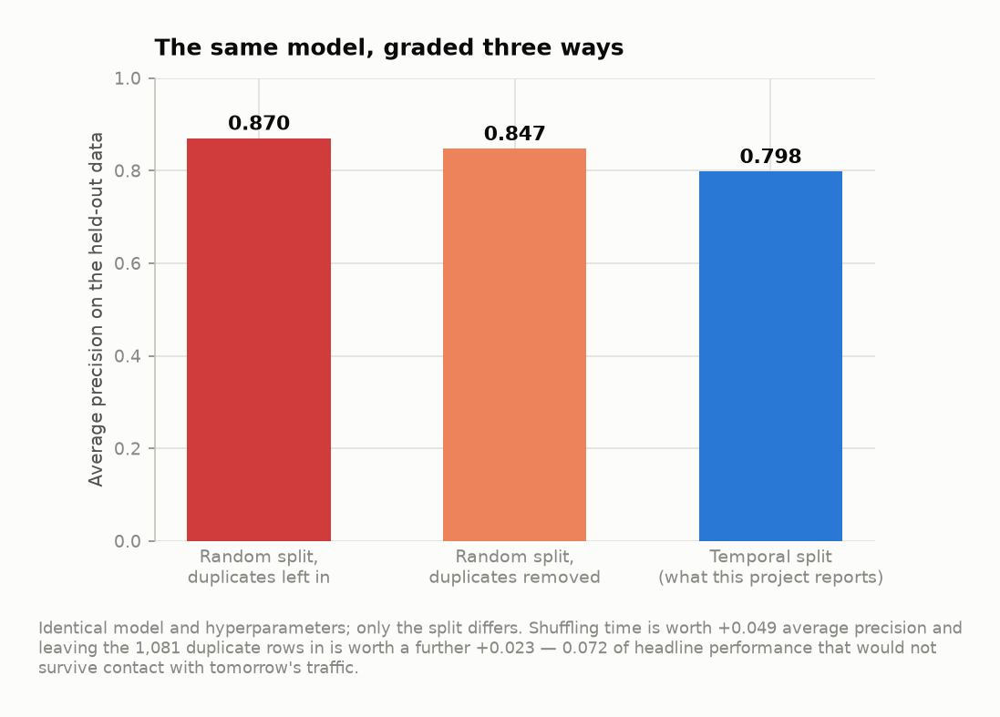
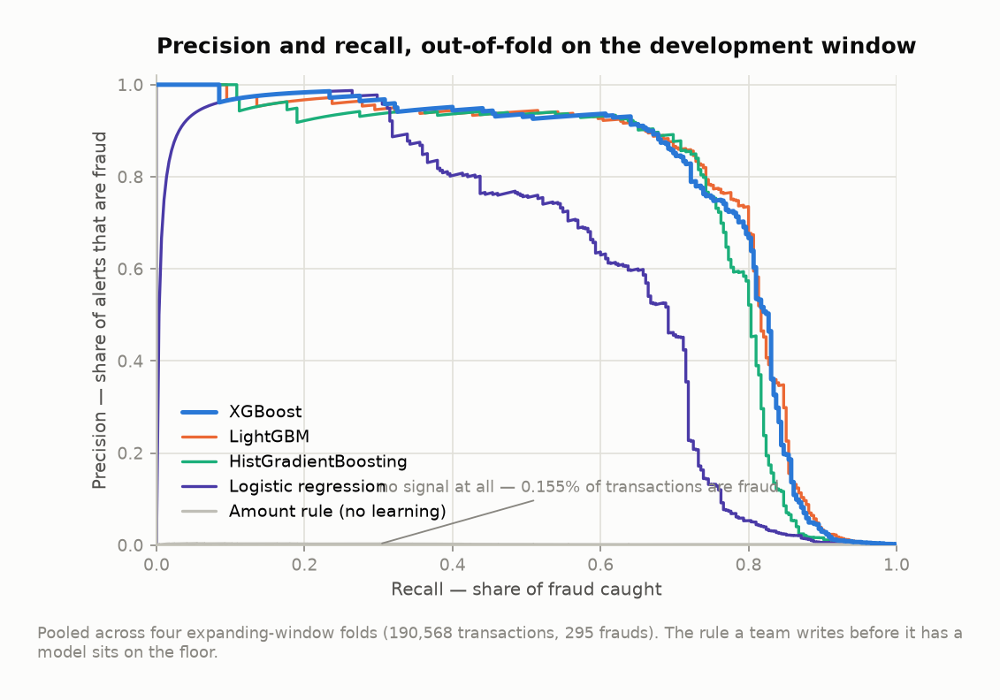
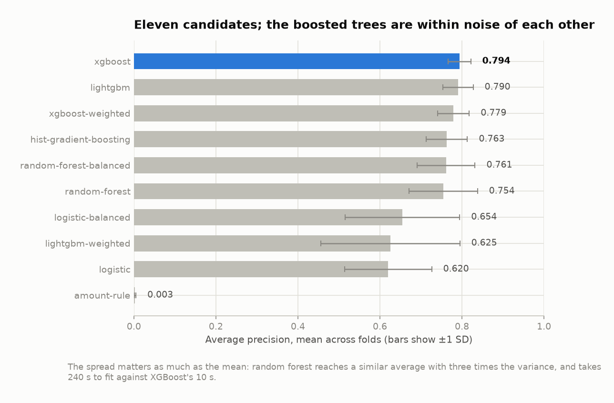
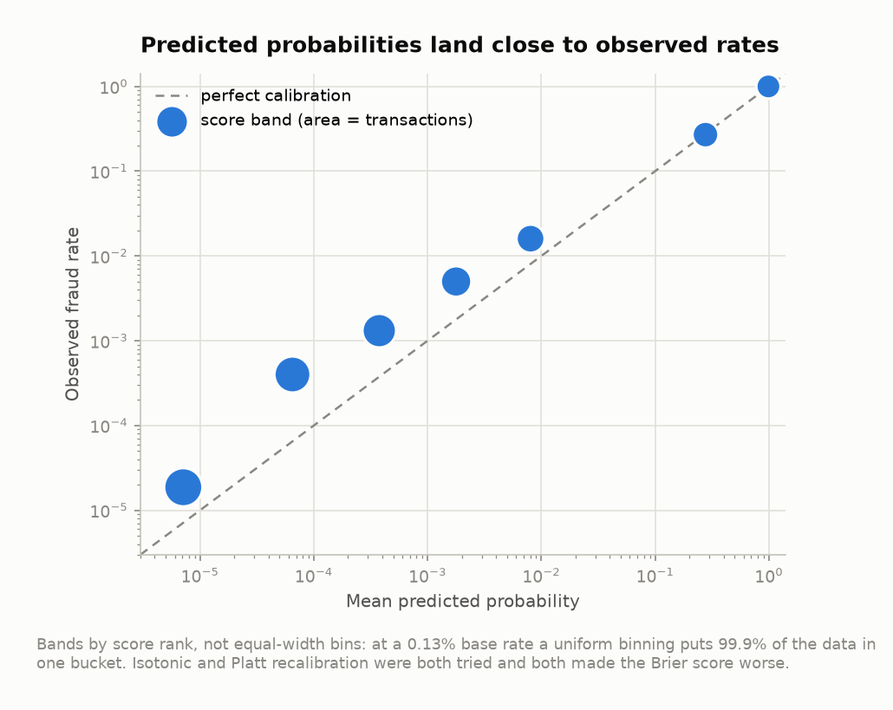
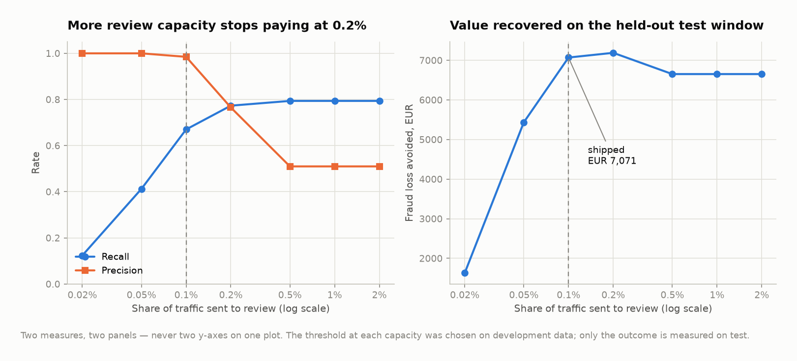
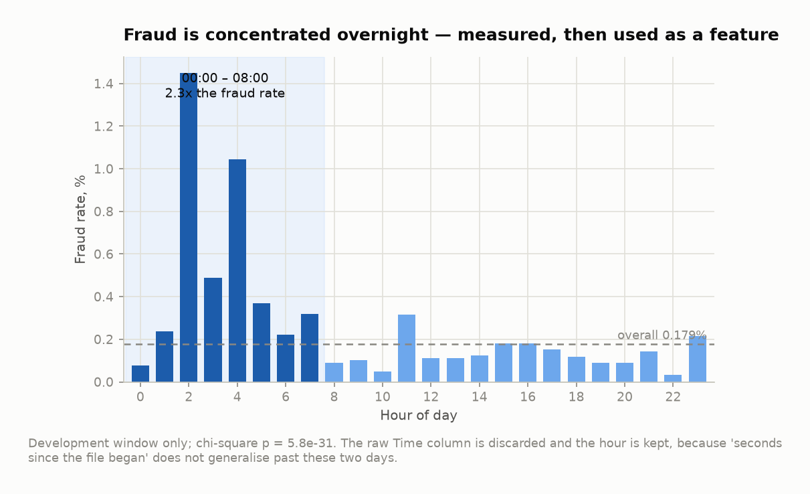
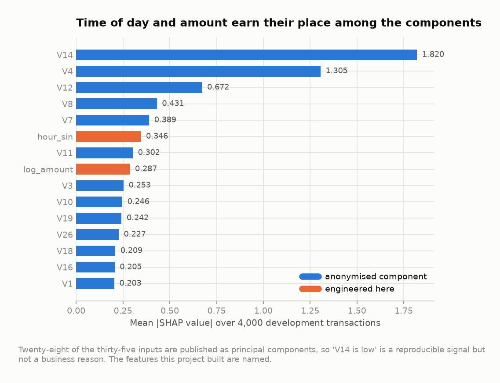
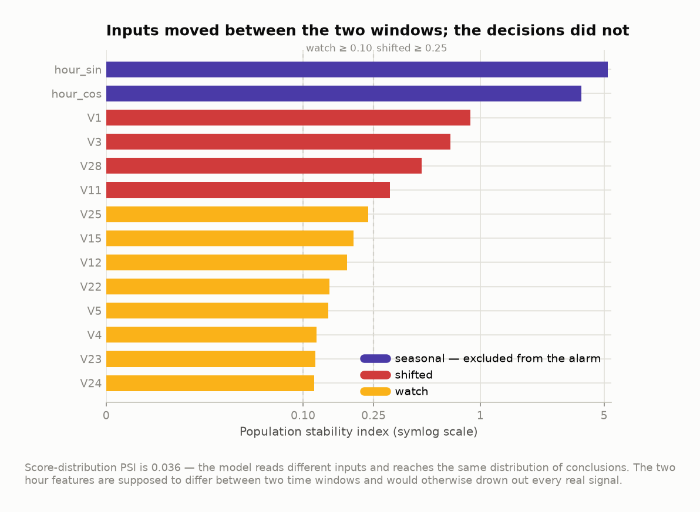

<div align="center">

# Backstop

**Card-fraud decisioning that is graded on the future, priced in euros, and can say why.**

[](https://github.com/Ganatra-Ruchir/backstop/actions/workflows/ci.yml)
[](https://python.org)
[](https://xgboost.readthedocs.io)
[](https://fastapi.tiangolo.com)
[](tests/)
[](LICENSE)

</div>

---

On 283,726 real card transactions, Backstop catches **65 of the 97 frauds** in a held-out window it
has never seen — in exchange for **one false alarm**, at an alert rate of 0.090%, avoiding
**€7,071 of the €11,596** that would otherwise be lost. It answers a single transaction in
**2.1 ms**, and every alert arrives with the reasons it fired.

The headline number is **average precision 0.798**. Most published work on this dataset reports
higher. That is the point of the project, and the first section explains it.

<div align="center">
  
</div>

---

## The number that is lower on purpose

The dataset spans 48 hours. Almost every notebook written on it takes a random 80/20 split, which
puts Tuesday's transactions in training and Monday's in test — the model is graded on a shuffled
version of the past, not on the future it will actually meet. That is not a small effect:

| How the data was split | Average precision |
|---|---|
| Random, duplicate rows left in | 0.870 |
| Random, duplicates removed | 0.847 |
| **Temporal — train on the first 38 hours, test on the last 10** | **0.798** |

Identical model, identical hyperparameters. Shuffling time is worth **+0.049**; leaving in the 1,081
byte-identical duplicate rows — where the same transaction can land on both sides of the split — is
worth a further **+0.023**. Together, **0.072** of headline performance that would not survive
contact with tomorrow's traffic.

`scripts/leakage_demo.py` runs this comparison. `tests/test_no_leakage.py` fails the build if the
gap ever disappears, because it disappearing would mean either the leak was fixed upstream or the
test stopped testing anything — both worth knowing about.

## What it does

```
transaction ──► feature pipeline ──► XGBoost ──► score ──► threshold ──► decision
                     │                              │          │              │
              fitted inside                   SHAP reasons  chosen by     review
              each fold only                                expected cost  or approve
```

**The problem.** A card network authorises a transaction in the time it takes a terminal to beep.
Refusing a good customer costs a relationship; letting a fraud through costs its full value. The
decision has to be made in milliseconds, on 0.17% prevalence, and — in a regulated setting —
defended afterwards.

**The users.** A fraud analyst working a review queue with a fixed daily capacity, and the risk
manager who has to justify where the threshold sits.

**The output.** Not a probability. A decision — *review* or *approve* — with the model version and
threshold that produced it, and the four features that pushed it over the line.

## Results

Everything below is measured on the **held-out test window**: the final 10 hours, 73,434
transactions, 97 frauds. It was scored once, with the model and threshold already fixed.

| | |
|---|---|
| Average precision | **0.798** &nbsp;·&nbsp; 95% CI [0.721, 0.870] |
| ROC-AUC | 0.985 |
| Brier score | 0.00040 |
| Recall at a 0.1% alert budget | **0.701** &nbsp;(precision 0.932) |
| Recall at 0.1% false-positive rate | 0.794 |
| At the shipped threshold | 66 alerts · **65 caught** · **1 false alarm** · 32 missed |
| Fraud loss avoided | **€7,071** of €11,596 exposure — 62.5% of what a perfect oracle would save |
| Latency, one transaction | p50 **2.1 ms** · p99 2.7 ms |
| Throughput, batched | 24,000 transactions/second |

The confidence interval is there for a reason: 97 positives is not many, and a rerun on a different
ten hours could plausibly land at 0.72. A single decimal place would be false precision.

<div align="center">
  
</div>

## The decisions behind the numbers

### Choosing a model when six of them tie

Eleven candidates, cross-validated across four expanding time windows.

<div align="center">
  
</div>

The top six overlap completely in their bootstrap confidence intervals. XGBoost's 0.772
[0.727, 0.819] and HistGradientBoosting's 0.751 [0.696, 0.801] are not distinguishable on this data,
and picking the top row of a leaderboard would be picking noise. The decision came from the
secondary criteria:

| | XGBoost | LightGBM | HistGradientBoosting | Random forest |
|---|---|---|---|---|
| Recall at the operating point | **0.607** | 0.600 | 0.603 | 0.586 |
| Fit time | 10 s | 30 s | **4.5 s** | 240 s |
| Model size | 575 KB | 1.8 MB | **305 KB** | 2.9 MB |
| Single-row latency | 6.9 ms | 4.7 ms | 5.6 ms | 61 ms |

XGBoost wins where it matters — highest recall at the alert budget the system actually runs at, the
lowest fold-to-fold variance of any candidate (±0.028), and three times faster to fit than LightGBM
at a third of the size. Random forest is disqualified on latency alone: 61 ms is not an
authorisation path, whatever its recall.

HistGradientBoosting would be the choice if dependency footprint mattered more than 0.02 of average
precision — it ships inside scikit-learn.

**Two things that did not work, kept in the repository because they were measured:**

*Class reweighting hurt.* At 558 negatives per positive the reflex is `scale_pos_weight`. It cost 2
points of average precision on XGBoost, and LightGBM's `is_unbalance` cost 35 — from 0.790 to 0.625
— while quadrupling the Brier score. Resampling was not tried at all: SMOTE and undersampling both
move the base rate the model sees, and this system needs probabilities that mean what they say,
because the threshold is chosen by expected cost.

*Post-hoc calibration hurt.* Isotonic regression and Platt scaling were both fitted on held-out
development predictions. Isotonic made the Brier score worse (0.00074 against 0.00054 raw) *and*
cost 6 points of average precision by collapsing distinct scores into ties; Platt made it worse too
(0.00064). With ~150 positives to fit on, the calibrator overfits — and XGBoost's log-loss objective
already lands close enough. The shipped probabilities are raw model output.

<div align="center">
  
</div>

### Choosing a threshold when F1 is the wrong question

Maximising F1 asserts that a missed €2,000 fraud and a missed €5 fraud cost the same, and that a
false alarm costs exactly as much as a missed fraud. Neither is true, so the threshold is chosen by
expected cost instead: a missed fraud costs its amount, a review costs analyst time, a declined good
customer costs some share of the transaction.

Then the sensitivity analysis said something unexpected. Across twelve combinations of review cost
(€1–€30) and decline friction (0–20%), **the chosen threshold does not move at all**. The
alert-rate constraint binds long before the cost trade-off does. Which means the operating point is
set by how many transactions a team can review — not by how the costs are priced, and arguing about
the price of an analyst-hour will not change it.

So the table that actually informs the decision is this one:

<div align="center">
  
</div>

| Review capacity | Alerts | Recall | Precision | Saved |
|---|---|---|---|---|
| 0.02% | 12 | 0.124 | 1.000 | €1,629 |
| 0.05% | 40 | 0.412 | 1.000 | €5,436 |
| **0.10%** | **66** | **0.670** | **0.985** | **€7,071** |
| 0.20% | 98 | 0.773 | 0.765 | €7,190 |
| 0.50% | 151 | 0.794 | 0.510 | €6,653 |

Doubling the review team from 0.1% to 0.2% of traffic buys ten more points of recall and **€119**.
Past that, more capacity actively loses money. That is a staffing conversation, and the model's job
was to make it a numerical one.

### Features, chosen by testing hypotheses rather than by adding ideas

Twenty-eight of the thirty-five inputs are anonymised principal components that arrive as-is. The
seven built here were each tested on development data before being added, and one was rejected:

| Hypothesis | Fraud rate lift | chi-square *p* | |
|---|---|---|---|
| Occurs overnight (00:00–08:00) | **2.34×** | 5.8e-31 | kept |
| Zero-amount authorisation | **6.96×** | 1.3e-20 | kept |
| Whole-euro amount | 1.42× | 2.1e-06 | kept |
| Amount is a multiple of 10 | 1.00× | 1.00 | **rejected** |

<div align="center">
  
</div>

The zero-amount finding is the interesting one: 1,447 transactions in the development window have an
amount of €0.00, and 1.24% of them are fraud against a 0.18% base rate. Those are card-verification
probes — a fraudster checking which stolen numbers are still live before spending on them.

Two decisions about time are load-bearing. The raw `Time` column is **discarded**: it is seconds
since the file began, and a tree given it will happily learn "fraud is likely around t = 4,000",
which is true of these two days and useless on any others. The hour of day is kept, encoded as
sine and cosine, so that 23:59 and 00:01 are two minutes apart rather than twenty-four hours.

<div align="center">
  
</div>

### Where it fails

A recall number says a third of fraud got through. It does not say whether that third is random.

| Amount band | Frauds | Recall |
|---|---|---|
| €0–1 | 26 | 0.73 |
| €1–10 | 31 | 0.68 |
| **€10–50** | **10** | **0.30** |
| €50–200 | 13 | 0.92 |
| €200–1k | 15 | 0.60 |
| €1k+ | 2 | 0.50 |

**Value-weighted recall is 0.627 against count-weighted 0.670** — the model misses a larger share of
the euros than of the transactions, and there is a visible hole in the €10–50 band. The most
expensive miss was €1,097, scored 0.000288: not a near-miss, an invisible one. Only 10 of the 32
misses scored within a factor of ten of the threshold, which is why more review capacity does not
help — the model is confidently wrong about them, not undecided.

So the obvious fix was tried: weight each fraud example by its amount during training, so the loss
function knows a €1,000 fraud matters more than a €1 one.

| Sample weighting | AP | Value-weighted recall | Saved |
|---|---|---|---|
| None (shipped) | **0.772** | 0.617 | €23,157 |
| 1 + log(amount) | 0.760 | 0.575 | €21,520 |
| 1 + √amount | 0.761 | 0.624 | €23,429 |
| 1 + amount | 0.751 | **0.638** | **€23,914** |

It works, slightly: full amount weighting recovers 3.3% more money. It was **not shipped**, for
three reasons. The €757 gain is a single-sample estimate from one 48-hour window with no interval
around it, and it sits well inside the ±0.05 bootstrap spread on average precision. It costs 2
points of ranking quality that would show at every other operating point. And the weighted model's
output is no longer an estimate of P(fraud) — it is a value-tilted score, which breaks both the
calibration story and the expected-cost threshold logic that depends on it. With real cost data and
more than two days of traffic, it should be revisited. `scripts/amount_weighted_experiment.py`
reproduces the table.

### Knowing when the world has moved

Labels arrive late — a chargeback is not confirmed the day the transaction clears — so the only
signal available in the first weeks is what the inputs look like.

<div align="center">
  
</div>

Four features crossed the action threshold between the two windows. The score distribution moved
almost not at all (PSI 0.036): the model is reading different inputs and reaching the same
distribution of conclusions, which is a model generalising rather than a model breaking. The alarm
weights prediction drift above input drift for exactly that reason.

The two hour features register PSI of 5.2 and 3.7 — an order of magnitude above the loudest genuine
signal — because the two windows cover different times of day. They are *supposed* to differ, so
they are measured, reported, and excluded from the alarm. A monitor that pages on seasonality is a
monitor people learn to ignore.

## Trying it

```bash
git clone https://github.com/Ganatra-Ruchir/backstop.git
cd backstop

python -m venv .venv && source .venv/bin/activate
pip install -r requirements-dev.txt

python scripts/download_data.py    # 144 MB, verified against a known row and fraud count
make all                           # eda → model comparison → train → evaluate → figures
```

`make all` takes about twelve minutes, most of it fitting the random forests in the comparison.
Every number in this README comes out of it.

To serve the trained model:

```bash
make serve                                    # or: docker compose up --build
curl localhost:8000/health
```

```bash
curl -X POST localhost:8000/score -H 'content-type: application/json' -d '{
  "transaction_id": "t-4417", "time": 43200, "amount": 149.62,
  "V1": -1.36, "V2": -0.07, "V3": 2.54, ... , "V28": -0.02
}'
```

```json
{
  "transaction_id": "t-4417",
  "score": 0.983901,
  "decision": "review",
  "threshold": 0.852681,
  "model_version": "20260906-212200",
  "reasons": [
    {"feature": "V14", "contribution": 3.82, "direction": "raises",
     "explanation": "V14 is low (-3.83); anonymised component"},
    {"feature": "V10", "contribution": 3.54, "direction": "raises",
     "explanation": "V10 is low (-4.50); anonymised component"}
  ],
  "latency_ms": 2.09
}
```

The explanation is honest about its limits. "V14 is low" is a real, reproducible signal an analyst
can compare across alerts — but it is not a business reason, and the service does not dress it up as
one. The features that *do* carry meaning are named in plain language: *"zero-amount authorisation
(card testing pattern)"*, *"occurred overnight"*, *"amount is high for this portfolio"*.

<details>
<summary><strong>API</strong></summary>

| | |
|---|---|
| `POST /score` | One transaction. `?explain=false` skips SHAP. |
| `POST /score/batch` | Up to 1,000 at once. |
| `GET /health` | Loaded model version, threshold, feature count. |
| `GET /metrics` | Latency and score percentiles, alert rate, totals. |

Interactive documentation at `/docs`.

Validation is strict and every field is required: a service that silently imputes a missing feature
returns a confident number for an input it never saw, and nothing downstream can tell. Missing
components, negative amounts, out-of-range values, unknown fields and non-numeric input are all
rejected with a 422 rather than coerced. `tests/test_api.py` parametrises all eight cases.

The score percentiles on `/metrics` exist for a specific failure: when an upstream pipeline breaks —
a column arrives null, a unit changes — the service keeps returning 200s and the only visible
symptom is that the score distribution moves. That is detectable in minutes; waiting for labels
takes weeks.

</details>

<details>
<summary><strong>How the latency got to 2 ms</strong></summary>

The first working version answered a single transaction in 8.4 ms (p99 12.3 ms). Profiling put
**3.6 ms of it inside the pandas-based feature transformer**, against 0.3 ms in the booster itself —
building and slicing intermediate DataFrames for one row.

Single-row scoring now takes a numpy path that computes the same features directly into a float
array. p50 fell to 2.1 ms and p99 to 2.7 ms, a 4.6× improvement at the tail.

A fast path that quietly disagrees with the path the model was trained through is a far worse bug
than a slow one, so `tests/test_features.py` asserts the two produce **bit-identical** output on
real rows, and `scripts/benchmark_service.py` checks the served scores against the offline
predictions on every run (max difference: 2.6e-10).

</details>

## How it is built

```
src/backstop/
├─ config.py            every parameter that changes a result, in one place
├─ data/
│  ├─ loader.py         loading, verification, the data-quality report
│  └─ splits.py         temporal split, expanding folds with a purge gap
├─ features/pipeline.py feature construction, fitted inside folds only
├─ models/
│  ├─ zoo.py            eleven candidates and the two baselines they must beat
│  ├─ train.py          cross-validation, out-of-fold predictions, latency
│  └─ registry.py       versioned artifacts with a verified manifest
├─ evaluation/
│  ├─ metrics.py        AP, recall at budget, recall at FPR, bootstrap intervals
│  ├─ cost.py           the cost model and threshold search
│  └─ figures.py        one place that decides what a chart looks like
├─ explain/reasons.py   SHAP, and reason codes built from it
├─ monitoring/drift.py  PSI and KS, with seasonality handled
└─ serving/             FastAPI, strict schemas, the numpy fast path
```

Design decisions and the reasoning behind them are in
[docs/ARCHITECTURE.md](docs/ARCHITECTURE.md); what the model is and is not fit for is in
[docs/MODEL_CARD.md](docs/MODEL_CARD.md); the full evaluation protocol is in
[docs/EVALUATION.md](docs/EVALUATION.md).

**A model artifact is not a pickle.** It is a directory containing the fitted pipeline and a
manifest recording the threshold and how it was chosen, the exact feature list, the SHA-256 of the
training data, the library versions, and the metrics it was accepted on. Loading verifies the
manifest checksum and refuses a major library version change, so the service cannot silently run a
different model from the one that was evaluated. Rolling back is `BACKSTOP_MODEL_VERSION=<previous>`
and a restart, not a retrain under pressure.

## Tests

85 tests, none of which need a network. The ones that need the 144 MB dataset or a trained model are
marked `slow` and skip cleanly on a fresh clone.

| File | What it pins down |
|---|---|
| `test_no_leakage.py` | Nothing in test was available at training time — three mechanisms, three assertions |
| `test_data.py` | Split ordering, purge gaps, deduplication, the real file's shape |
| `test_features.py` | Cyclical hour, fitted-on-training-only statistics, fast path ≡ pandas path |
| `test_metrics.py` | The budget ceiling, undefined-vs-zero, stratified bootstrap |
| `test_cost.py` | Budget respected, monotone in review cost, the threshold-grid bug |
| `test_pipeline_and_models.py` | Every candidate fits; out-of-fold really is out-of-fold; drift; registry |
| `test_explain.py` | Contributions sum back to the prediction |
| `test_api.py` | Contract, eight rejection cases, service ≡ offline, latency budget |

Two of them exist because of bugs this project actually had.
`test_cost.py::test_candidate_thresholds_resolve_the_tail` is there because an evenly spaced
quantile grid could not resolve a 0.1% alert budget — the finest step moved the alert count by
hundreds, so the optimiser silently returned whichever single point happened to be feasible.
`test_explain.py::test_contributions_sum_back_to_the_prediction` is there because SHAP's
`expected_value` is not settled until the explainer has run once, and reading it too early made
every explanation miss its own prediction by a constant.

```bash
make test        # everything
make test-fast   # skip the slow ones
make lint
```

## Honest limitations

- **Two days of data.** Every number here comes from a 48-hour window in September 2013. There is no
  weekly seasonality in it, no holiday, no campaign. The confidence intervals are wide for a reason.
- **Anonymised features.** V1–V28 are principal components. Real feature engineering — velocity per
  card, merchant risk, device and geography, distance from the cardholder's usual behaviour — is
  impossible here and would matter more than the model choice. There is no card identifier, so no
  per-entity aggregate exists.
- **The cost assumptions are assumptions.** €3 per review, 5% friction on a false decline. They are
  varied in the sensitivity analysis and turn out not to be load-bearing, but they are not measured.
- **Single writer.** The `/metrics` histograms are process-local. Scale with replicas behind a load
  balancer and aggregate metrics externally.
- **No feedback loop.** A deployed fraud model changes the data it is next trained on: blocked
  transactions never produce labels. Handling that properly needs a held-out control group, which
  needs a production system to hold out from.

## What I would build next

Feature velocity per card, once there is an entity key. A champion/challenger harness so a
retrained model has to beat the incumbent on live traffic before taking over. Anchoring the drift
monitor to a rolling reference rather than a fixed training window. And a labelling delay
simulation, because every offline evaluation here quietly assumes labels are instant.

## Data and licence

The dataset is the [ULB / Worldline credit-card fraud data](https://www.kaggle.com/datasets/mlg-ulb/creditcardfraud)
(Dal Pozzolo et al., Université Libre de Bruxelles): 284,807 real card transactions from two days in
September 2013, 492 of them fraudulent, released under the Open Database Licence. It is not
redistributed here — `scripts/download_data.py` fetches and verifies it.

Code is MIT — see [LICENSE](LICENSE).

<div align="center">
<sub>Built by <a href="https://github.com/Ganatra-Ruchir">Ruchir Ganatra</a> · <a href="https://linkedin.com/in/ruchir-ganatra">LinkedIn</a></sub>
</div>
