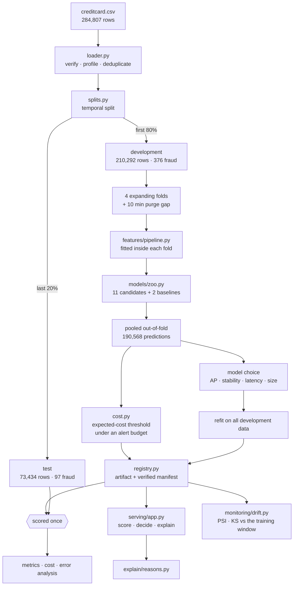

# Architecture

How Backstop is put together, and why. [EVALUATION.md](EVALUATION.md) covers the measurement
protocol; [MODEL_CARD.md](MODEL_CARD.md) covers what the model is fit for. This is about the shape
of the code.

## The one-paragraph version

A scikit-learn pipeline with an XGBoost head, wrapped in a FastAPI service, with everything that
decides a result — the split, the features, the thresholds, the costs — declared in one config
module. There is no orchestrator, no feature store, no queue and no experiment-tracking server,
because at this size each of those is more operational surface than it repays. What is here instead
is the discipline those tools usually carry: fitted state cannot escape a fold, the threshold is
part of the model artifact, the artifact verifies itself on load, and the service proves it
reproduces the offline scores.

## Flow



The single arrow into `scored once` is the whole protocol. Everything upstream of it is a decision;
everything downstream is a measurement.

## Where each decision lives

**`config.py`** holds every parameter that changes an outcome: the seed, the split fractions, the
number of folds, the purge gap, the cost assumptions, the alert budget, the latency budget. A run is
reproducible from this file. Nothing that affects a result is a default buried in a function
signature.

**`data/loader.py`** does the reading and the refusing. The published CSV has no header row and
quotes its class label, so column names and the target dtype are imposed rather than inferred —
inference on this file yields a string target and silently eats the first row into a header. Loading
in strict mode asserts the row and fraud counts, so a truncated or substituted file fails here
rather than three steps later inside a model.

**`data/splits.py`** is the leakage boundary. Three mechanisms can put the future into training and
each has a countermeasure: random splitting (order by time and cut), duplicate rows straddling the
boundary (deduplicate first), and transformers fitted on everything (fit inside the pipeline, inside
the fold).

**`features/pipeline.py`** builds 35 features under two rules. Nothing may be fitted outside a fold —
the amount-percentile statistic and the scaler are both learned from training rows only. And nothing
may encode position in this particular window: the raw `Time` column is seconds since the file
began, so it is turned into cyclical hour features and dropped.

**`models/zoo.py`** declares the candidates, including two baselines they have to beat. A model
comparison without a floor is a ranking of numbers with no meaning; the amount rule is what a team
writes on day one, and anything that cannot beat it is not worth operating.

**`evaluation/cost.py`** turns a probability into a decision and prices it. This is where the
project's opinion lives: the operating point is a business decision, not a modelling one, and
maximising F1 quietly asserts a cost model nobody wrote down.

**`models/registry.py`** makes an artifact more than a pickle. A pickle tells you nothing about what
data it saw, what threshold it runs at, or what it scored — all of which are needed before anything
declines a customer's card.

## Choices, and what they cost

| Decision | Cost | Why |
|---|---|---|
| Temporal split | 0.072 of headline average precision | It is the only split that estimates deployed performance |
| Raw probabilities, no recalibration | Slight over-confidence in the top band | Both calibrators were measured and both made it worse |
| No resampling | Nothing measurable | SMOTE and undersampling move the base rate, and the threshold depends on calibrated probabilities |
| XGBoost over HistGradientBoosting | One extra dependency | Best recall at the operating point, lowest fold-to-fold variance |
| Threshold inside the artifact | Cannot tune it without a redeploy | A model and the threshold it was accepted at are one object; separating them is how a system drifts silently |
| numpy fast path in serving | A second implementation to keep honest | 8.4 ms → 2.1 ms; a bit-identity test keeps it honest |
| Explanations on flagged rows only | Approved transactions have no reasons attached | SHAP is the expensive part and nobody reads the reason for an approval |
| No experiment tracker | Runs are compared from JSON in `artifacts/` | One person, eleven candidates, a twelve-minute pipeline — MLflow would be a server to operate, not a problem solved |

## The serving path

A single transaction takes a different route from a batch, for a measured reason.

```
POST /score                          POST /score/batch
      │                                     │
   pydantic validation (strict)      pydantic validation
      │                                     │
   raw_matrix()  ── numpy ──┐        raw_matrix()
      │                     │               │
   booster.predict_proba    │        booster.predict_proba
      │                     │               │
   threshold                │        threshold
      │                     │               │
   SHAP, only if flagged    │        SHAP, only if asked
      │                     │               │
   decision + reasons       │        decisions
                            │
              the pandas transform this replaces
              cost 3.6 ms of an 8.4 ms response
```

Validation is strict and total. Every field is required; missing components, out-of-range values,
unknown fields and non-numeric input are rejected rather than coerced. A service that silently
imputes returns a confident number for an input it never saw, and nothing downstream can tell.

The bounds on the anonymised components are wide — ±200 against an observed range of about ±70 —
because they are a sanity check on payload corruption, not a business rule. Rejecting a genuinely
extreme transaction would reject exactly the kind the model exists to find.

## Monitoring

Two signals, weighted differently.

*Input drift* is detectable immediately from unlabelled traffic, which matters because labels arrive
weeks late. PSI (the credit-risk convention, with thresholds people already trust) and the KS
statistic (distribution-free, with a p-value PSI lacks) are computed per feature. Neither is read
alone: with 73,000 rows a KS test flags differences far too small to act on.

*Prediction drift* — the score distribution itself — is weighted more heavily in the alarm. Inputs
move constantly; what matters is whether the moving inputs changed what the model decides. On the
test window four features cross the action threshold while the score distribution barely moves
(PSI 0.036), which is a model generalising rather than a model breaking.

Seasonal features are measured and excluded from the alarm. The hour features register PSI of 5.2
and 3.7 between two windows covering different times of day — an order of magnitude above the
loudest genuine signal, and they would drown out everything real. A monitor that pages on
seasonality is a monitor people learn to ignore.

## What would change at scale

- **The rate of scoring.** The per-process metrics histograms would move to a real metrics backend,
  and the service would run as stateless replicas.
- **The number of models.** Eleven candidates compared once fit in a JSON file. A hundred runs a
  week does not, and that is the point at which MLflow or Weights & Biases starts repaying its
  operational cost.
- **The feature set.** Velocity features per card require an entity key and a state store — the
  single largest missing capability here, and a bigger lever than any model choice.
- **The retraining loop.** A champion/challenger harness, so a retrained model has to beat the
  incumbent on live traffic before taking over, with the drift monitor as the trigger rather than a
  calendar.
